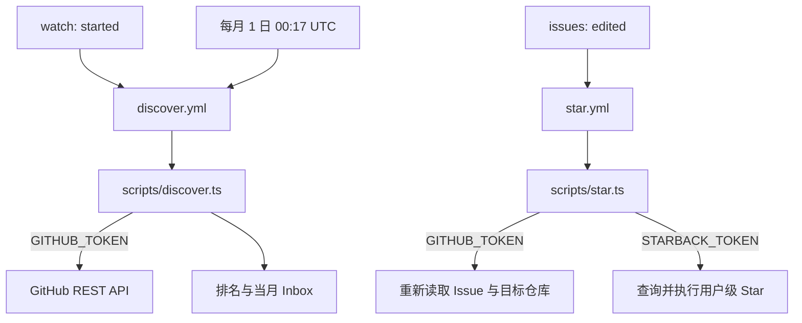

# StarBack

> **StarBack — discover great projects from your stargazers, then star back with one click.**

StarBack 是一个完全运行在 GitHub 内部的开源工具：当有人给你的仓库点 Star 时，它会读取这位 stargazer 自己拥有的公开仓库，按确定性规则排序后写入按月分页的 Inbox Issue。你在 Issue 中勾选项目，StarBack 就会使用你的个人 PAT 完成 Star。

它不需要服务器、数据库或外部队列，只使用 GitHub Actions、Issues 和 REST API。

## 架构



两条工作流都使用 Node 24 原生 TypeScript。发现任务按仓库串行更新 Inbox；Star 任务按 Issue 编号串行处理。每个并发组使用 `queue: max`，最多保留 100 个 pending run，避免密集事件替换排队任务。GitHub Actions 使用 `GITHUB_TOKEN` 更新 Inbox 不会递归触发新的 workflow。

## 发现与排名

`watch: started` 会：

1. 确保 `starback-inbox` 标签存在（颜色 `0969da`，描述 `Managed by StarBack`）。
2. 关闭标题合法、月份早于当前 UTC 月份的开放 Inbox。
3. 分页读取 stargazer 自己拥有的公开仓库。
4. 过滤 fork、archived、disabled、空仓库（`size === 0`）以及没有 `pushed_at` 的仓库。
5. 排除当月 Inbox 已经出现过的目标，只将去重后排名最高的 1 个目标追加到最后一页。

评分为：

```text
35 × log1p(stars) / log1p(maxStars)
+ 30 × clamp(1 - pushedAgeDays / 365, 0, 1)
+ 10 × log1p(forks) / log1p(maxForks)
+ 10（有非空 description）
+ 10（有 topics）
+  5（有 homepage）
```

最大 Star 数或 Fork 数为 0 时，对应分项为 0。相同总分依次按 Star 数降序、`pushed_at` 降序、`full_name` 升序排列。一次 `watch: started` 最多产生 1 条推荐；每个 Inbox 页面最多有 100 条生成推荐，容量跨多个事件累计，满页后创建 `#2`、`#3` 等后续页面。

推荐行示例：

```text
- [ ] owner/repo — TypeScript · ★126 <!-- starback-run:RUN_ID -->
```

月份按 UTC 计算。HTML marker 不影响 Issue 显示，用于同一个 workflow run 重跑时幂等退出；仓库标识比较不区分大小写。

## 安装与启用

StarBack v0.1 只支持个人账号名下的仓库。

1. 将本仓库 Fork 到你的个人 GitHub 账号下。
2. 在 fork 的 `Settings → General → Features` 中启用 **Issues**。
3. 在 `Settings → Actions → General` 中允许 Actions 运行，并确认 workflow 可以使用仓库的 `GITHUB_TOKEN`。
4. 在你的 GitHub 账号中创建 fine-grained personal access token：
   - Resource owner 选择你的账号。
   - Repository access 只选择这个 StarBack 仓库。
   - Repository permissions 保留 `Metadata: Read-only`。
   - Account permissions 设置 `Starring: Read and write`。
   - 不需要 PAT 的 `Issues: write` 权限。
5. 在 StarBack 仓库的 `Settings → Secrets and variables → Actions` 中新建仓库 Secret：
   - Name：`STARBACK_TOKEN`
   - Secret：刚创建的 PAT
6. 确认 `.github/workflows/discover.yml` 和 `.github/workflows/star.yml` 已启用。

`GITHUB_TOKEN` 由 Actions 自动提供；Issue 创建、更新、关闭和标签操作都由它完成。`STARBACK_TOKEN` 只注入到事件 `sender` 是仓库 owner、且通过 Inbox 标签和 Issue 类型检查的 Star job，并且只用于用户级 Star API。

## 使用方式

安装完成后，其他用户给你的仓库点 Star 会触发发现 workflow。推荐会写入当月 Inbox，例如 `StarBack Inbox · August 2026`；超过 100 条时会继续写入 `· #2`。

打开 Inbox，勾选你想回点 Star 的项目：

```text
- [x] owner/repo — TypeScript · ★126 <!-- starback-run:123456789 -->
```

workflow 会重新读取最新 Issue。如果你在它开始前取消勾选，StarBack 会跳过该项目。已经 Star 的项目保持勾选；目标不存在、不可公开访问、PAT 缺失或 API 失败的项目会恢复为 `[ ]`，并让 workflow 失败以便你看到问题。取消勾选不会自动 Unstar。

## 安全原则

- `GITHUB_TOKEN` 只负责仓库元数据、Issue、标签和公开仓库读取，以及 Inbox 写入。
- `STARBACK_TOKEN` 代表仓库 owner 的 GitHub 身份，仅调用用户级 Starring API。
- workflow 条件和脚本都会检查事件编辑者（`sender`）是个人仓库 owner，并检查个人仓库、非 Pull Request 和 `starback-inbox` 标签。Inbox 可由 `github-actions[bot]` 创建，Issue 作者不是授权依据。
- 不要把 PAT 写进 Issue、仓库文件、workflow 日志或公开评论。
- v0.1 不支持组织仓库、受信任成员代 Star、后台自动 Star 或取消勾选自动 Unstar。

## 常见问题

### 没有生成 Inbox

确认仓库是个人账号拥有、Issues 和 Actions 已启用，并检查 `StarBack Discover` workflow 的运行日志。发现只处理 `watch: started`，同一 workflow run 重跑不会重复写入。

### 勾选后 workflow 失败

检查 `STARBACK_TOKEN` 是否仍有效、Resource owner 是否为仓库 owner、Repository access 是否只包含该仓库，以及 `Starring: Read and write` 是否已授予。失败项目会被恢复为未勾选。

### 为什么没有推荐某个仓库

它可能是 fork、archived、disabled、空仓库、没有 push 时间，或已在当前 UTC 月份的 Inbox 中出现。StarBack 不做永久去重；下个月可以再次推荐同一目标。

### 为什么定时任务只关闭 Issue

每月维护任务只关闭合法且过期的 Inbox，不读取 stargazer，也不会自动生成推荐。

## 本地开发

需要 Node `>=24.12 <25`：

```text
npm ci
npm run typecheck
npm test
```

入口命令为 `npm run discover` 和 `npm run star`，它们在 Actions 中直接运行 `.ts` 文件；项目不生成或提交 `dist`，也没有生产运行依赖。

## License

[MIT License](LICENSE)
