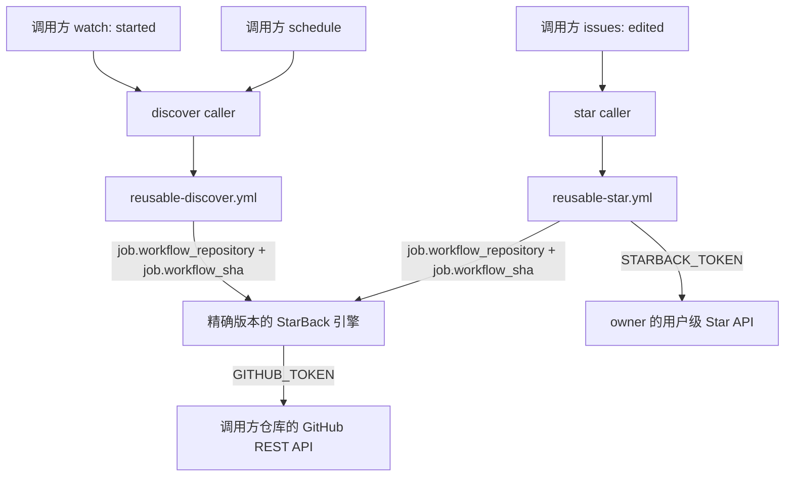

# StarBack

> **StarBack — discover great projects from your stargazers, then star back with one click.**

StarBack 是一个可复用的 GitHub 原生引擎：当有人给你的仓库点 Star 时，它会读取这位 stargazer 自己拥有的公开仓库，按确定性规则排序后写入当前调用方仓库的按月分页 Inbox Issue。仓库 owner 在 Issue 中勾选项目，StarBack 就会使用 owner 的个人 PAT 完成 Star。

你不需要 Fork StarBack 源码仓库。任意个人 GitHub 仓库都可以通过 reusable workflow 调用公开的 StarBack 引擎。StarBack 源码仓库自身也是第一个调用方，用来 dogfood 同一条事件链。

它不需要服务器、数据库或外部队列，只使用 GitHub Actions、Issues 和 REST API。

## 架构



调用关系分为三层：

- Caller 提供事件上下文、调用方仓库、权限、`GITHUB_TOKEN` 和 `STARBACK_TOKEN`。
- Reusable workflow 从 `job.workflow_repository` 与 `job.workflow_sha` checkout 引擎到 `.starback`，不默认 checkout 调用方仓库。
- TypeScript 引擎运行 `node .starback/scripts/discover.ts` 或 `node .starback/scripts/star.ts`，所有 Issue 和 Star 操作都发生在调用方仓库与 owner 账号上。

StarBack caller 使用公开仓库的 `main` 分支：

```text
fly233338/StarBack/.github/workflows/reusable-discover.yml@main
fly233338/StarBack/.github/workflows/reusable-star.yml@main
```

外部 caller 使用公开仓库的 `main` 分支：

```text
fly233338/StarBack/.github/workflows/reusable-discover.yml@main
fly233338/StarBack/.github/workflows/reusable-star.yml@main
```

两个 caller 文件已经写好上述引用；如需固定版本，可自行将引用替换为已验证的 commit SHA。

## 仓库结构

```text
.github/workflows/
  reusable-discover.yml       # workflow_call，无 inputs、无用户 Secret
  reusable-star.yml           # workflow_call，必需 STARBACK_TOKEN
  starback-discover.yml       # StarBack 自用 watch/schedule caller
  starback-star.yml           # StarBack 自用 issues caller
scripts/                      # 引擎入口
src/                          # GitHub REST、排名、Inbox、checkbox 逻辑
test/                         # Node 内置 test runner + fetch mock
```

## 安装到个人仓库

StarBack v0.1 只支持个人账号拥有的调用方仓库。

### 1. 启用仓库能力

在你的个人仓库中：

1. `Settings → General → Features` 启用 **Issues**。
2. `Settings → Actions → General` 允许 Actions 运行。
3. 确认仓库允许使用公开 reusable workflows。个人仓库通常可直接调用公开的 `fly233338/StarBack`；组织策略可能需要管理员允许。

### 2. 直接复制两个 caller 文件

将以下两个文件原样复制到目标仓库的 `.github/workflows/` 目录。文件已经包含事件、权限、owner 校验和 `@main` 引用，不需要手写或修改 YAML：

- [复制 starback-discover.yml](https://github.com/fly233338/StarBack/blob/main/.github/workflows/starback-discover.yml)
- [复制 starback-star.yml](https://github.com/fly233338/StarBack/blob/main/.github/workflows/starback-star.yml)

打开文件后可使用 GitHub 文件页面的复制按钮，或直接复制文件内容。

### 3. 创建 owner PAT

在你的 GitHub 账号中创建 Personal access token (classic)：

- 进入 `Settings → Developer settings → Personal access tokens → Tokens (classic)`。
- 创建新的 classic token。
- Scope 勾选 `public_repo`。
- 不需要额外授予 Issue 权限；Inbox 的创建和更新由 GitHub Actions 自动提供的 `GITHUB_TOKEN` 完成。

在调用方仓库的 `Settings → Secrets and variables → Actions` 中新建：

```text
Name: STARBACK_TOKEN
Secret: 你的 classic PAT
```

## 发现与排名

`watch: started` 会：

1. 确保 `starback-inbox` 标签存在（颜色 `0969da`，描述 `Managed by StarBack`）。
2. 关闭标题合法、月份早于当前 UTC 月份的开放 Inbox。
3. 分页读取 stargazer 自己拥有的公开仓库。
4. 过滤 fork、archived、disabled 以及没有 `pushed_at` 的仓库。
5. 排除当月 Inbox 已经出现过的目标，只将去重后排名最高的 1 个目标追加到最后一页。

评分为：

```text
35 × log1p(stars) / log1p(maxStars)
+ 30 × clamp(1 - pushedAgeDays / 365, 0, 1)
+ 10 × log1p(forks) / log1p(maxForks)
+ 10（有非空 description）
+ 10（有 topics）
+  5（有 homepage）
```

最大 Star 数或 Fork 数为 0 时，对应分项为 0。相同总分依次按 Star 数降序、`pushed_at` 降序、`full_name` 升序排列。

一次 `watch: started` 最多产生 1 条推荐；每个 Inbox 页面最多有 100 条生成推荐，容量跨多个事件累计，满页后创建 `#2`、`#3` 等后续页面。

推荐行示例：

```text
- [ ] owner/repo — TypeScript · ★126 <!-- starback-run:RUN_ID -->
```

月份按 UTC 计算。HTML marker 不影响 Issue 显示，用于同一个 workflow run 重跑时幂等退出；仓库标识比较不区分大小写。

## 使用方式

其他用户给调用方仓库点 Star 会触发 Discover caller。推荐写入当前调用方仓库的当月 Inbox，例如 `StarBack Inbox · August 2026`；超过 100 条时继续写入 `· #2`。

打开 Inbox，勾选你想回点 Star 的项目：

```text
- [x] owner/repo — TypeScript · ★126 <!-- starback-run:123456789 -->
```

Star caller 会重新读取最新 Issue。如果你在它开始前取消勾选，StarBack 会跳过该项目。已经 Star 的项目保持勾选；目标不存在、不可公开访问、PAT 缺失或 API 失败的项目会恢复为 `[ ]`，并让 workflow 失败。取消勾选不会自动 Unstar。

Inbox 可以由 `github-actions[bot]` 创建；授权依据是本次 `issues.edited` 的 `sender` 是调用方仓库 owner。

## 安全原则

- 调用方的 `GITHUB_TOKEN` 负责调用方仓库元数据、Issue、标签和公开仓库读取，以及 Inbox 写入。
- `STARBACK_TOKEN` 只由 Star caller 显式传给 reusable star，并且只代表调用方 owner 调用用户级 Starring API。
- Caller 和引擎都会检查个人仓库、事件仓库匹配、`sender` 是 owner、非 Pull Request 和 `starback-inbox` 标签。
- 不使用 `secrets: inherit`；不把 PAT 写进 Issue、仓库文件、workflow 日志或公开评论。
- v0.1 不支持组织仓库、受信任成员代 Star、后台自动 Star 或取消勾选自动 Unstar。

## 常见问题

### 没有生成 Inbox

确认调用方仓库是个人账号拥有、Issues 和 Actions 已启用，且允许使用公开 reusable workflows。检查 `StarBack Discover` caller 的运行日志。发现只处理 `watch: started`；同一 workflow run 重跑不会重复写入。

### 为什么 Inbox 在我的仓库而不是 StarBack 仓库

这是预期行为。事件、`GITHUB_REPOSITORY` 和 `GITHUB_TOKEN` 都属于调用方；StarBack 只提供引擎代码，所有资源写入调用方仓库。

### 勾选后 workflow 失败

检查调用方 caller 是否授予 `issues: write`，`STARBACK_TOKEN` 是否仍有效，以及 classic PAT 是否包含 `public_repo` scope。失败项目会被恢复为未勾选。

### 为什么没有推荐某个仓库

它可能是 fork、archived、disabled、没有 push 时间，或已在当前 UTC 月份的 Inbox 中出现。StarBack 不做永久去重；下个月可以再次推荐同一目标。

### 为什么外部 caller 无法加载 reusable workflow

确认 StarBack 仓库公开、调用方组织允许公开 reusable workflows，并且复制的是最新的两个 caller 文件；它们默认引用 `fly233338/StarBack` 的 `main` 分支。

## 本地开发

需要 Node `>=24.12 <25`：

```text
npm ci
npm run typecheck
npm test
```

入口命令仍是 `node scripts/discover.ts` 和 `node scripts/star.ts`；reusable workflow 会从精确引擎 checkout 路径 `.starback` 直接运行它们。项目不生成或提交 `dist`，也没有生产运行依赖。

## License

[MIT License](LICENSE)
